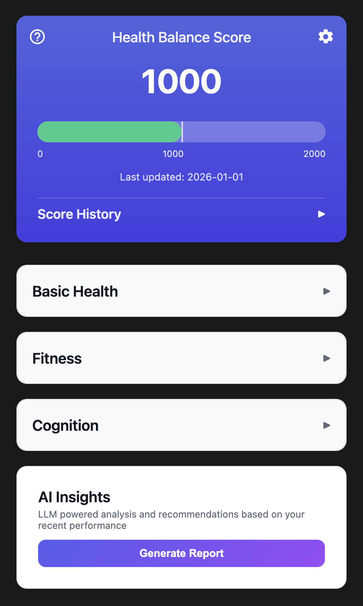

<p align="center">  </p>

# Health Balance Tracker

A PWA that keeps track of your Biological Reserve Score. It goes beyond simple activity tracking to assess your physical and mental resources through a weighted algorithm that measures functional longevity.

### Features
- **Overall Score Algorithm**: Starting at 1000 points, your score evolves weekly based on performance and aging.
- **Three Pillar System**:
  - **Health Pillar**: Sleep, WHtR, RHR, Nutrition.
  - **Fitness Pillar**: VO2 Max, Workouts, Steps, Mobility, Recovery.
  - **Cognition Pillar**: Mindfulness, Deep Learning, Working Memory, Reaction Time.
- **Aging Rate**: Automatic weekly decay based on your age.
- **AI-Powered Insights**: Get personalized health summaries and recommendations generated by Gemini.

> [!TIP]
> To know more about it, run the app and visit the /rationale page.

## Dashboard Preview
<p align="center">
  
</p>

## Quick Start

The application is distributed as a multi-platform Docker image via the GitHub Container Registry. For the best experience on a local machine, use the provided docker-compose.yml.
Navigate to the project root and run:
```bash
docker-compose up -d
```

### Configuration
The application is configured using environment variables. Most are **optional**:
- `VAPID_PUBLIC_KEY`: (Optional) Your Web Push public key. Required to enable weekly reminders.
- `VAPID_PRIVATE_KEY`: (Optional) Your Web Push private key. Required to enable weekly reminders.
- `GEMINI_API_KEY`: (Optional) Your Google AI Studio API key. Required to enable the **AI Insights** feature.
- `GEMINI_MODEL_NAME`: (Optional) The name of the Gemini model to use (default: `gemini-3-flash-preview`).
- `PORT`: (Optional) The port to listen on (default: `8080`).

> [!NOTE]
> If VAPID keys are not provided, the "Weekly Reminders" feature will be disabled in the settings UI.

To provide variables, create a .env file in the same directory as the docker-compose.yml:
```bash
VAPID_PUBLIC_KEY=your_key_here
VAPID_PRIVATE_KEY=your_key_here
```
Use the provided script to generate them:
```sh
chmod +x scripts/generate-keys.sh
./scripts/generate-keys.sh
```

## Secure Hosting

Since this application does not have built-in authentication yet, it is highly recommended to host it on a local server and expose it securely using a Cloudflare Tunnel. This allows you to access the app from anywhere without opening any ports on your router.
A Cloudflare Tunnel (cloudflared) creates a secure, outbound-only connection to Cloudflare’s network.
To prevent anyone from accessing your data, add an Access Application in the Cloudflare Dashboard and configure a Policy to only allow your specific email address.

## Data Persistence

The application uses a **Bind Mount** to ensure your health data persists on your host machine.

- **Host Path**: `./data` (relative to your `docker-compose.yml`)
- **Mount Point**: `/data` (inside the container)
- **Database File**: `./data/health.db`

## Backups & Recovery

The database is configured with **Write-Ahead Logging (WAL)** mode, which allows for safe "hot" backups while the application is running.

### Atomic Backups to NAS

To perform a safe, "hot" backup from your host (e.g., to a NAS), use the `sqlite3` command directly on your host machine. This ensures the backup is consistent and avoids corruption.

```bash
# Atomic, high-performance backup directly from the host
sqlite3 ./data/health.db ".backup '/path/to/your/nas/health_backup.db'"
```

> [!TIP]
> You can automate this by adding the command above to your host's crontab:
> ```bash
> 0 3 * * * sqlite3 /path/to/health-balance/data/health.db ".backup '/path/to/nas/health_backup_$(date +\%Y\%m\%d).db'"
> ```

### Restore Procedure
If you need to recover data from a backup:
1. Stop the container: docker-compose down.
2. Overwrite the current DB: `cp ./backups/health_20240101.db ./data/health.db`.
3. Ensure permissions: Run `chmod 666 ./data/health.db` to ensure the container can write to it.
4. Start the container: `docker-compose up -d`.
